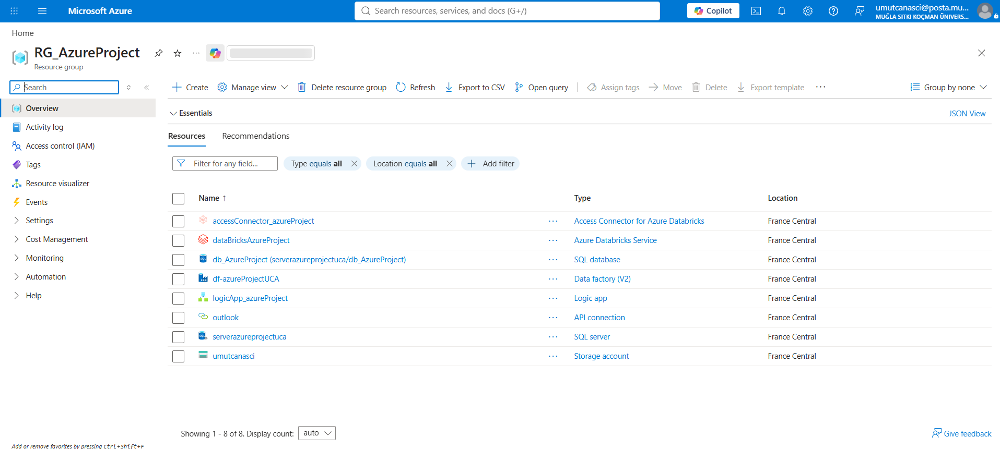
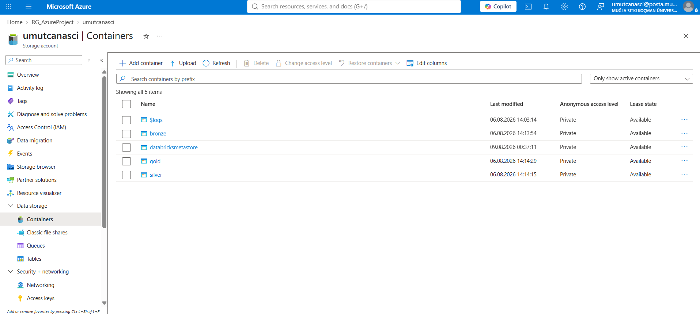
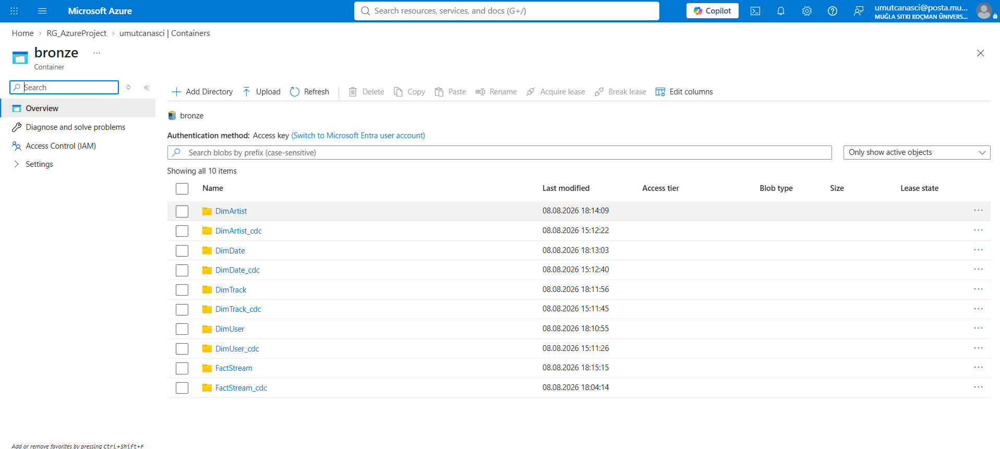
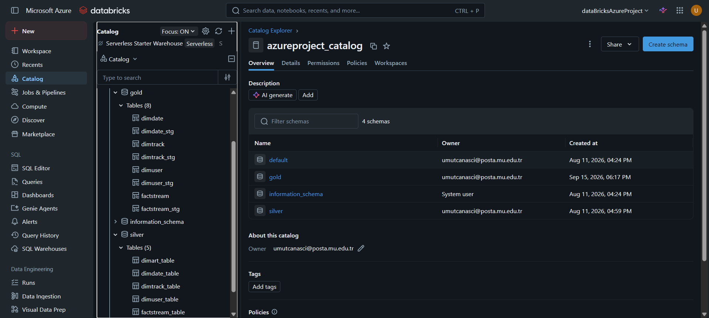
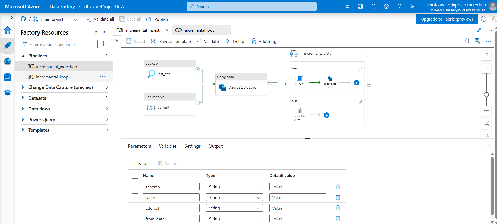
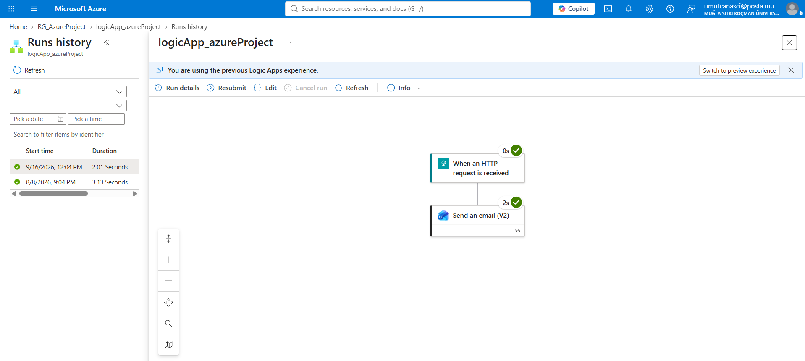
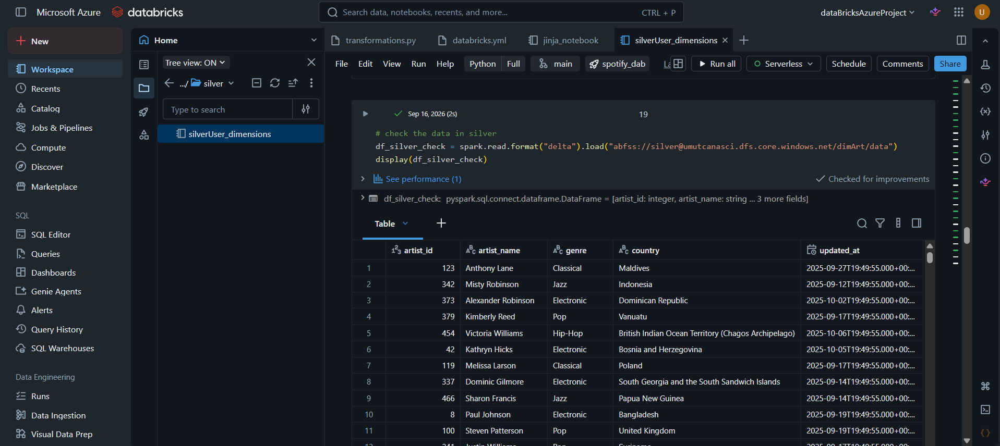
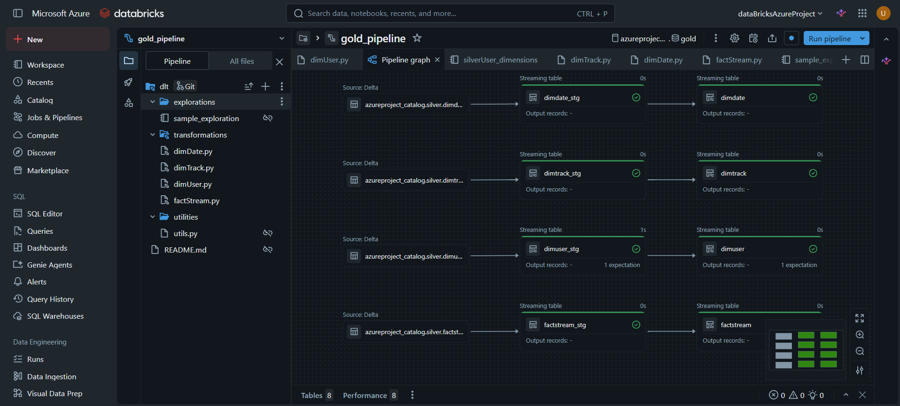
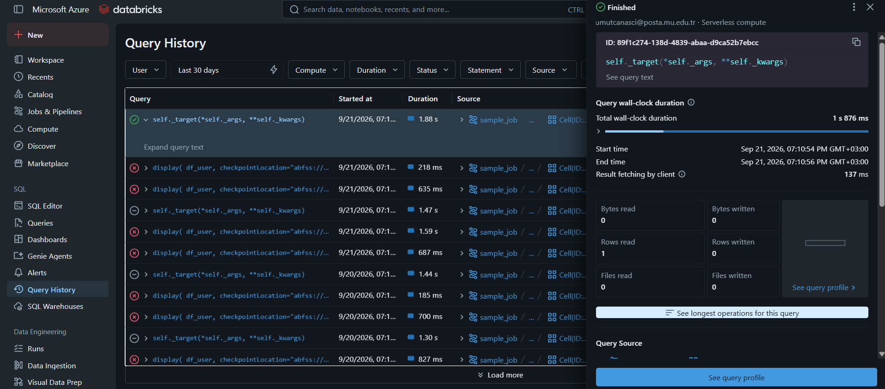
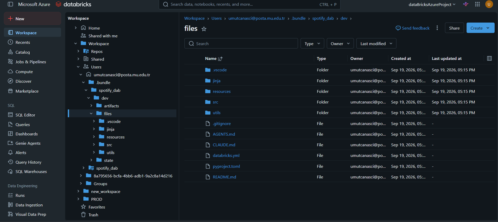

# 🎵 Enterprise Spotify Lakehouse Platform

### End-to-End Data Engineering on Microsoft Azure & Databricks

[](https://azure.microsoft.com/en-us/products/data-factory)
[-FF3621?style=for-the-badge&logo=databricks&logoColor=white)](https://docs.databricks.com/en/dev-tools/bundles/index.html)
[](https://delta.io/)
[](https://docs.databricks.com/en/delta-live-tables/index.html)
[](https://www.databricks.com/product/unity-catalog)
[](https://spark.apache.org/)
[](https://www.python.org/)
[](#-medallion-architecture--adls-gen2-storage-topology)
[](#-infrastructure-as-code-databricks-asset-bundles)
[-181717?style=for-the-badge&logo=github&logoColor=white)](https://github.com/UmutCanAsci/AzureProject)

---

> **AzureProject** is a fully production-grade, enterprise-scale Modern Data Lakehouse implementation built entirely on Microsoft Azure and Databricks. It ingests Spotify relational music-streaming data from Azure SQL Database using a **metadata-driven, watermark-based Change Data Capture (CDC)** orchestrated by **Azure Data Factory (ADF)**, persists it across a three-tier **Medallion Architecture** (Bronze / Silver / Gold) on **Azure Data Lake Storage Gen2**, governs all assets through **Databricks Unity Catalog**, applies modular **PySpark Structured Streaming** transformations with **Jinja2 template-driven dynamic SQL**, delivers analytics-ready star-schema marts via **Delta Live Tables (DLT)** with declarative data quality expectations, and manages the full deployment lifecycle using **Databricks Asset Bundles (DAB)** in a unified Git Monorepo.

---

## 📋 Table of Contents

1. [Executive Architecture Overview](#-executive-architecture-overview)
2. [Technology Stack](#-technology-stack)
3. [Medallion Architecture & ADLS Gen2 Storage Topology](#-medallion-architecture--adls-gen2-storage-topology)
4. [Data Ingestion & Orchestration Engine](#-data-ingestion--orchestration-engine-adf--logic-apps)
5. [Databricks Engineering & Transformation Framework](#-databricks-engineering--transformation-framework)
6. [Delta Live Tables & Data Quality](#-delta-live-tables-dlt--data-quality-gold-pipeline)
7. [Infrastructure as Code — Databricks Asset Bundles](#-infrastructure-as-code-databricks-asset-bundles)
8. [Unified Repository Structure (Monorepo)](#-unified-repository-structure-monorepo)
9. [Prerequisites](#-prerequisites)
10. [Setup & Deployment Guide](#-setup--deployment-guide)
11. [Data Flow Reference Tables](#-data-flow-reference-tables)
12. [Key Engineering Decisions](#-key-engineering-decisions)

---

## 🏛️ Executive Architecture Overview

```
┌──────────────────────────────────────────────────────────────────────────────────────┐
│                        [ Azure SQL Database ]                                        │
│              Source: DimArtist · DimDate · DimTrack · DimUser · FactStream           │
└───────────────────────────────┬──────────────────────────────────────────────────────┘
                                │  CDC / Watermark-Based Incremental Query
                                ▼
┌──────────────────────────────────────────────────────────────────────────────────────┐
│               AZURE DATA FACTORY  ·  df-azureProjectUCA                              │
│                                                                                      │
│  ┌─────────────────────────────────────────────────────────────────────────────┐     │
│  │  Pipeline: incremental_loop                                                  │     │
│  │    Parameter: loop_input (JSON Array)                                        │     │
│  │    Fields: { schema, table, cdc_col, from_date }                             │     │
│  │    Activity: ForEach1  ──► Triggers incremental_ingestion per table          │     │
│  └──────────────────────────────┬──────────────────────────────────────────────┘     │
│                                 │                                                    │
│  ┌──────────────────────────────▼──────────────────────────────────────────────┐     │
│  │  Pipeline: incremental_ingestion                                             │     │
│  │    1. Lookup          (last_cdc)     → fetch last successful watermark       │     │
│  │    2. Set Variable    (current)      → capture current system timestamp      │     │
│  │    3. Copy Data       (AzureSQLtoLake) → write Snappy Parquet to bronze/    │     │
│  │    4. If Condition    (If_incrementalData)                                   │     │
│  │         ├── [TRUE]  → max_cdc → update_last_cdc  (advance watermark)        │     │
│  │         └── [FALSE] → DeleteEmptyFile             (purge zero-byte files)    │     │
│  └──────────────────────────────────────────────────────────────────────────────┘     │
│                                                                                      │
│  Monitoring: Alerts (Web Activity) ──► logicApp_azureProject ──► Outlook Email      │
└───────────────────────────────┬──────────────────────────────────────────────────────┘
                                │  Snappy Parquet & JSON
                                ▼
┌──────────────────────────────────────────────────────────────────────────────────────┐
│           AZURE DATA LAKE STORAGE GEN2  ·  Storage Account: umutcanasci              │
│                                                                                      │
│  🥉 bronze/        Raw ingestion zone + per-table CDC change logs                    │
│  🥈 silver/        Cleansed, normalised Delta tables + streaming checkpoint store    │
│  🥇 gold/          Analytics-ready star-schema marts (DLT-managed)                  │
│  🛡️  databricksmetastore/   Unity Catalog root (__unitystorage)                      │
└───────────────────────────────┬──────────────────────────────────────────────────────┘
                                │  Access Connector for Azure Databricks (RBAC / MSI)
                                ▼
┌──────────────────────────────────────────────────────────────────────────────────────┐
│           AZURE DATABRICKS WORKSPACE  ·  dataBricksAzureProject                      │
│                                                                                      │
│  Governance  ── Unity Catalog: azureproject_catalog                                  │
│                    ├── Schema: silver  (Delta tables)                                │
│                    └── Schema: gold    (DLT-managed marts)                           │
│                                                                                      │
│  Transformations                                                                     │
│    ├── utils/transformations.py        OOP helper class  (reusable)                  │
│    ├── jinja/jinja_notebook.ipynb      Jinja2 SQL template engine                    │
│    └── src/silver/silverUser_dimensions.ipynb   Structured Streaming + preview()     │
│                                                                                      │
│  Gold Pipeline  (DLT · gold_pipeline · Serverless)                                   │
│    ├── Staging  →  dimdate_stg · dimtrack_stg · dimuser_stg · factstream_stg         │
│    └── Target   →  dimdate    · dimtrack    · dimuser    · factstream                 │
│                    (DLT Expectations enforced on dimuser / dimuser_stg)               │
│                                                                                      │
│  IaC  ─── Databricks Asset Bundles (DAB)                                             │
│    ├── Target: dev   →  /Users/umutcanasci@posta.mu.edu.tr/.bundle/                  │
│    └── Target: prod  →  /Workspace/PROD/.bundle/                                     │
└──────────────────────────────────────────────────────────────────────────────────────┘
```

[](#)
<!-- SCREENSHOT PLACEHOLDER: Azure Portal → Resource Group overview showing all provisioned resources: df-azureProjectUCA (ADF), umutcanasci (ADLS Gen2), dataBricksAzureProject (Databricks), logicApp_azureProject (Logic Apps), accessConnector_azureProject (Access Connector). -->

---

## 🧰 Technology Stack

| Layer | Service / Tool | Role |
|---|---|---|
| **Source** | Azure SQL Database | Relational OLTP source (Spotify schema) |
| **Orchestration** | Azure Data Factory v2 | Metadata-driven CDC ingestion pipelines |
| **Alerting** | Azure Logic Apps + Outlook API | Automated pipeline failure notifications |
| **Storage** | ADLS Gen2 (`umutcanasci`) | Medallion zone containers |
| **File Format** | Apache Parquet (Snappy) + Delta Lake | Compressed raw & versioned analytical storage |
| **Governance** | Databricks Unity Catalog | Centralised metastore, RBAC, lineage |
| **Identity** | Access Connector for Azure Databricks | Managed Identity (MSI) for ADLS access |
| **Compute** | Azure Databricks (Serverless DLT) | PySpark transformations & DLT pipelines |
| **Templating** | Jinja2 | Dynamic SQL join generation |
| **Serving** | Delta Live Tables (DLT) | Declarative streaming DAG with expectations |
| **IaC** | Databricks Asset Bundles (DAB) | Declarative multi-environment deployment |
| **Version Control** | Git Monorepo (`main` branch) | ADF JSON + DAB YAML in unified repository |

---

## 🥇 Medallion Architecture & ADLS Gen2 Storage Topology

The storage account `umutcanasci` is partitioned into four purpose-specific containers, each corresponding to a distinct data maturity tier or governance concern.

```
abfss://bronze@umutcanasci.dfs.core.windows.net/
│
├── DimArtist/              ← Full raw snapshot (Snappy Parquet)
├── DimArtist_cdc/          ← Incremental CDC change records
├── DimDate/
├── DimDate_cdc/
├── DimTrack/
├── DimTrack_cdc/
├── DimUser/
├── DimUser_cdc/
├── FactStream/
└── FactStream_cdc/

abfss://silver@umutcanasci.dfs.core.windows.net/
│
├── dimArt/                 ← Cleansed & normalised Delta table
├── dimDate/
├── dimTrack/
├── dimUser/
├── factStream/
└── _temp_checkpoints/      ← Ephemeral Structured Streaming checkpoint store
    └── {uuid4}/            ← Per-run isolated checkpoint path

abfss://gold@umutcanasci.dfs.core.windows.net/
│                           (Fully managed by Delta Live Tables runtime)
├── dimdate/                ← Star-schema dimension mart
├── dimtrack/
├── dimuser/                ← DLT Expectation-validated dimension
└── factstream/             ← Central fact mart

abfss://databricksmetastore@umutcanasci.dfs.core.windows.net/
└── __unitystorage/         ← Unity Catalog metastore root (system-managed)
```

[](#)
<!-- SCREENSHOT PLACEHOLDER: Azure Portal → Storage Account (umutcanasci) → Containers blade, showing all four containers: bronze, silver, gold, databricksmetastore. -->

[](#)
<!-- SCREENSHOT PLACEHOLDER: Azure Portal → Storage Account → bronze container, showing DimArtist/, DimArtist_cdc/, DimUser/, DimUser_cdc/, etc. -->

### Unity Catalog Metastore Architecture

The `accessConnector_azureProject` resource (Access Connector for Azure Databricks) is assigned the **Storage Blob Data Contributor** role on the `databricksmetastore` container via Azure RBAC. This eliminates the need for storage access keys or SAS tokens, replacing them with Managed Identity (MSI)-based authentication. The metastore root is bound to `abfss://databricksmetastore@umutcanasci.dfs.core.windows.net/__unitystorage`.

Unity Catalog hierarchy:
```
azureproject_catalog
├── silver                  ← Delta tables registered from src/silver notebooks
│   ├── dimuser_table
│   ├── dimtrack_table
│   ├── dimdate_table
│   └── factstream_table
└── gold                    ← DLT-managed schema (auto-registered)
    ├── dimdate
    ├── dimtrack
    ├── dimuser
    └── factstream
```

[](#)
<!-- SCREENSHOT PLACEHOLDER: Databricks UI → Catalog Explorer → azureproject_catalog → expanded silver schema showing registered Delta tables (dimuser_table, dimtrack_table, etc.) and gold schema. -->

---

## 🔄 Data Ingestion & Orchestration Engine (ADF & Logic Apps)


### Pipeline 1 — `incremental_loop`

The orchestration entry point. It accepts a single **JSON array parameter** (`loop_input`) containing one object per source table, eliminating all hard-coded table references from the ingestion layer.

**Parameter schema (`loop_input`):**

```json
[
  {
    "schema":    "dbo",
    "table":     "DimUser",
    "cdc_col":   "ModifiedDate",
    "from_date": "1900-01-01"
  },
  {
    "schema":    "dbo",
    "table":     "FactStream",
    "cdc_col":   "StreamDate",
    "from_date": "1900-01-01"
  }
]
```

The `ForEach1` activity iterates over each element of this array and invokes `incremental_ingestion` as a child pipeline, passing all four fields as parameters. The activity can be configured in **parallel** (default) or **sequential** mode depending on source system concurrency constraints.

[
<!-- SCREENSHOT PLACEHOLDER: ADF Studio → incremental_loop pipeline canvas, showing: Parameters panel (loop_input JSON array), ForEach1 activity connected to the Execute Pipeline activity, and the Alerts Web Activity on the failure port. -->

### Pipeline 2 — `incremental_ingestion`

The atomic ingestion unit, invoked once per source table per pipeline run. Executes a four-stage watermark-based CDC workflow:

```
┌─────────────────────────────────────────────────────────────────┐
│  Stage 1 — Lookup (last_cdc)                                    │
│  SELECT last_load_date FROM watermark_table                     │
│  WHERE table_name = @pipeline().parameters.table                │
│  → Emits: last_load_date (previous successful run boundary)     │
├─────────────────────────────────────────────────────────────────┤
│  Stage 2 — Set Variable (current)                               │
│  @utcNow()  → Captures pipeline execution timestamp             │
│  → Defines the upper bound of this extraction window            │
├─────────────────────────────────────────────────────────────────┤
│  Stage 3 — Copy Data (AzureSQLtoLake)                           │
│  Source:  AzureSQL_sourceDataset                                │
│    Query: SELECT * FROM [@schema].[@table]                      │
│           WHERE [@cdc_col] > @last_cdc AND [@cdc_col] <= @now  │
│  Sink:    Parquet_dynamic  (Snappy compression)                 │
│    Path:  @dataset().container / @dataset().folder              │
│           / @dataset().file                                     │
├─────────────────────────────────────────────────────────────────┤
│  Stage 4 — If Condition (If_incrementalData)                    │
│  Condition: activity('AzureSQLtoLake').output.rowsCopied > 0   │
│                                                                  │
│  [TRUE]   max_cdc → update_last_cdc                             │
│    UPDATE watermark_table SET last_load_date = @current         │
│    WHERE table_name = @pipeline().parameters.table              │
│                                                                  │
│  [FALSE]  DeleteEmptyFile                                       │
│    Removes the zero-byte Parquet staging file created by        │
│    Copy Data when no rows are transferred, preventing           │
│    storage pollution and downstream schema inference errors.     │
└─────────────────────────────────────────────────────────────────┘
```

[](#)
<!-- SCREENSHOT PLACEHOLDER: ADF Studio → incremental_ingestion pipeline canvas showing the linear activity chain: Lookup (last_cdc) → Set Variable (current) → Copy Data (AzureSQLtoLake) → If Condition (If_incrementalData) with TRUE/FALSE branches. -->

### Parameterised Dataset Design

Both sink datasets (`Parquet_dynamic`, `Json_dynamic`) are fully parameterised, allowing a **single dataset definition** to serve all containers and table paths:

```json
// Parquet_dynamic — Dataset parameters
{
  "container": "@dataset().container",
  "folder":    "@dataset().folder",
  "file":      "@dataset().file"
}
```

| Parameter | Example Value |
|---|---|
| `container` | `bronze` |
| `folder` | `DimUser_cdc` |
| `file` | `DimUser_2024-01-15.parquet` |

**Compression:** Snappy (industry standard for analytical Parquet workloads — optimal balance of compression ratio and CPU overhead at query time).

### Automated Alerting — Azure Logic Apps

The `Alerts` Web Activity is connected to both the **completion** and **failure** ports of `incremental_loop`. On trigger, it issues an HTTP POST to the Logic App's endpoint:

```
POST https://prod-XX.eastus.logic.azure.com:443/workflows/.../triggers/manual/paths/invoke

Body: {
  "pipelineName": "@pipeline().Pipeline",
  "runId":        "@pipeline().RunId",
  "status":       "@activity('ForEach1').Status",
  "timestamp":    "@utcNow()"
}
```

The Logic App (`logicApp_azureProject`) uses the **Outlook API connector** to deliver formatted HTML failure-notification emails to the operations team, including pipeline name, run ID, failure time, and ADF deep-link.

[](#)
<!-- SCREENSHOT PLACEHOLDER: Azure Portal → logicApp_azureProject → Logic App Designer, showing the HTTP Trigger step connected to the "Send an email (V2)" Outlook action with the ADF payload mapped to the email body. -->

---

## ⚙️ Databricks Engineering & Transformation Framework

### Modular OOP Transformation Library — `utils/transformations.py`

All reusable DataFrame manipulation logic is encapsulated in a single Python module, preventing code duplication across notebooks and ensuring consistent transformation semantics:

```python
# utils/transformations.py

class reusable:
    def dropColumns(self, df, columns):
        """
        Drops a list of columns from a PySpark DataFrame.

        Args:
            df      (DataFrame): Input PySpark DataFrame.
            columns (list[str]): Column names to remove.

        Returns:
            DataFrame: DataFrame with specified columns removed.
        """
        df = df.drop(*columns)
        return df
```

**Design rationale:** The `reusable` class acts as a namespace for stateless, side-effect-free DataFrame operations. Methods are instantiated once per notebook session and reused across all Silver-layer transformation workloads, enabling easy unit-testing and isolated mock injection.

### Jinja2 Template Engine — `jinja/jinja_notebook.ipynb`

Complex multi-table join SQL is never hand-authored. Instead, a metadata-driven **Jinja2 template engine** generates syntactically correct Spark SQL at runtime from a declarative parameter manifest:

```python
# jinja/jinja_notebook.ipynb — Parameter manifest (excerpt)

parameters = [
    {
        "table":     "azureproject_catalog.silver.factstream_table",
        "alias":     "factstream",
        "cols":      ["stream_id", "user_id", "track_id", "stream_date"],
        "joins": [
            {
                "table":     "azureproject_catalog.silver.dimuser_table",
                "alias":     "dimuser",
                "cols":      ["user_id", "user_name", "country"],
                "condition": "factstream.user_id = dimuser.user_id"
            },
            {
                "table":     "azureproject_catalog.silver.dimtrack_table",
                "alias":     "dimtrack",
                "cols":      ["track_id", "track_name", "artist_id"],
                "condition": "factstream.track_id = dimtrack.track_id"
            }
        ]
    }
]
```

The Jinja2 template renders this manifest into a complete `SELECT ... FROM ... JOIN ...` statement, which is then executed via `spark.sql()`. This approach eliminates SQL string concatenation anti-patterns and makes schema evolution (adding columns or joins) a configuration-only change.

### Dynamic Streaming Preview Utility — `src/silver/silverUser_dimensions.ipynb`

PySpark Structured Streaming development is hindered by checkpoint conflicts when multiple concurrent test runs target the same checkpoint directory. The `preview()` utility function resolves this by provisioning a **UUID-scoped, ephemeral checkpoint path** for each invocation:

```python
# src/silver/silverUser_dimensions.ipynb

import uuid

def preview(df, rows=10):
    """
    Materialises a Structured Streaming DataFrame into an in-memory
    sink for interactive inspection, using a dynamically generated
    checkpoint path to prevent write conflicts across concurrent runs.

    Args:
        df   (DataFrame): PySpark Streaming DataFrame.
        rows (int):       Number of rows to display (default: 10).
    """
    checkpoint_path = (
        f"abfss://silver@umutcanasci.dfs.core.windows.net"
        f"/_temp_checkpoints/{uuid.uuid4()}"
    )
    query = (
        df.writeStream
          .format("memory")
          .queryName("preview_query")
          .outputMode("append")
          .option("checkpointLocation", checkpoint_path)
          .start()
    )
    query.awaitTermination(timeout=15)
    spark.sql("SELECT * FROM preview_query LIMIT {}".format(rows)).show()
    query.stop()
```

**Key properties:**
- **Isolation:** Each call generates a fresh UUID-namespaced checkpoint directory under `_temp_checkpoints/`, guaranteeing zero conflicts between parallel notebook sessions.
- **In-memory sink:** The `memory` format never persists data to storage — the write is purely transient, suitable only for interactive development.
- **Automatic cleanup:** `_temp_checkpoints/` directories can be scheduled for periodic deletion via an ADF `Delete` activity or a Databricks job task to prevent storage cost accumulation.

[](#)
<!-- SCREENSHOT PLACEHOLDER: Databricks → silverUser_dimensions.ipynb → cell showing the preview() function and the resulting display() output of the streamed Silver Delta table rows. -->

---

## 🔬 Delta Live Tables (DLT) & Data Quality — Gold Pipeline

The Gold layer is implemented as a fully declarative **Serverless Delta Live Tables pipeline** (`gold_pipeline`), managed by the DAB resource definition `resources/spotify_dab_etl.pipeline.yml`. It reads from the `azureproject_catalog.silver` schema and materialises analytics-ready star-schema tables into `azureproject_catalog.gold`.

### Two-Stage DAG Architecture

```
azureproject_catalog.silver
    ├── dimdate_table
    ├── dimtrack_table
    ├── dimuser_table
    └── factstream_table
            │
            │  readStream (Autoloader / Delta)
            ▼
    ┌───────────────────┐      Stage 1: Streaming Staging Tables
    │   dimdate_stg     │  ←── spark.readStream.table("...silver.dimdate_table")
    │   dimtrack_stg    │
    │   dimuser_stg     │  ←── @dlt.expect_all_or_drop(expectations)
    │   factstream_stg  │
    └────────┬──────────┘
             │  dlt.create_streaming_table()
             ▼
    ┌───────────────────┐      Stage 2: Analytical Target Tables
    │   dimdate         │
    │   dimtrack        │
    │   dimuser         │  ←── Expectation-validated (user_id IS NOT NULL)
    │   factstream      │
    └───────────────────┘
            │
            ▼
    azureproject_catalog.gold  (queryable from BI / reporting layer)
```

### DLT Source Code — `src/gold/dlt/transformations/`

| File | Table Produced | Description |
|---|---|---|
| `dimDate.py` | `dimdate_stg` → `dimdate` | Date dimension streaming pipeline |
| `dimTrack.py` | `dimtrack_stg` → `dimtrack` | Track/song dimension streaming pipeline |
| `dimUser.py` | `dimuser_stg` → `dimuser` | User dimension with DLT Expectations |
| `factStream.py` | `factstream_stg` → `factstream` | Central streaming fact table |

### Data Quality Expectations — `dimUser.py`

```python
# src/gold/dlt/transformations/dimUser.py

import dlt

expectations = {
    "rule_1": "user_id IS NOT NULL",
}

@dlt.table
@dlt.expect_all_or_drop(expectations)
def dimuser_stg():
    """
    Streaming staging table for the User dimension.
    Reads from the Silver Delta table and applies DLT Expectations.
    Rows violating any expectation are DROPPED before reaching the target.
    """
    return spark.readStream.table("azureproject_catalog.silver.dimuser_table")


dlt.create_streaming_table(
    name="dimuser",
    expect_all_or_drop=expectations,
)
```

**`@dlt.expect_all_or_drop` semantics:** Any row failing a declared expectation is quarantined and excluded from the output table. DLT records dropped row counts in the pipeline event log, providing full observability of data quality violations without pipeline failure.

[](#)
<!-- SCREENSHOT PLACEHOLDER: Databricks → Delta Live Tables → gold_pipeline → Pipeline Graph view showing the full DAG with silver source nodes → _stg streaming tables → target dimension/fact nodes, with green (passed) or yellow (expectations dropped rows) quality indicators. -->

[](#)
<!-- SCREENSHOT PLACEHOLDER: Databricks → Delta Live Tables → gold_pipeline → Pipeline run details → Event Log tab, or the Data Quality panel showing expectation pass/fail metrics for dimuser (rule_1: user_id IS NOT NULL). -->

### Gold Pipeline — DLT Utilities (`src/gold/dlt/utilities/utils.py`)

A dedicated utility module within the DLT code package provides shared helper functions accessible to all transformation files in the `src/gold/dlt/` directory, consistent with the OOP modular philosophy applied at the Silver layer.

---

## 🚀 Infrastructure as Code — Databricks Asset Bundles

All Databricks resources are defined declaratively in YAML and deployed via the **Databricks CLI**, eliminating manual workspace configuration and enabling repeatable, auditable deployments.

### Bundle Root — `databricks.yml`

```yaml
bundle:
  name: spotify_dab
  uuid: 3231840f-e078-495f-8005-cca66f5e4291

include:
  - resources/*.yml

variables:
  catalog:
    description: Unity Catalog catalog name (injected per target)
  schema:
    description: Target schema name (injected per target)

targets:
  dev:
    mode: development
    default: true
    workspace:
      host: https://adb-7405616987721790.10.azuredatabricks.net
      root_path: /Workspace/Users/umutcanasci@posta.mu.edu.tr/.bundle/${bundle.name}
    variables:
      catalog: azureproject_catalog
      schema:  silver

  prod:
    mode: production
    workspace:
      host: https://adb-7405616987721790.10.azuredatabricks.net
      root_path: /Workspace/PROD/.bundle/${bundle.name}
    variables:
      catalog: azureproject_catalog
      schema:  gold
```

### DLT Pipeline Resource — `resources/spotify_dab_etl.pipeline.yml`

```yaml
# The main DLT pipeline for spotify_dab
resources:
  pipelines:
    spotify_dab_etl:
      name: spotify_dab_etl
      catalog: ${var.catalog}
      schema:  ${var.schema}
      serverless: true
      root_path: "../src/gold/dlt"
      libraries:
        - glob:
            include: ../src/gold/dlt/transformations/*.py
```

### Job Resource — `resources/sample_job.job.yml`

```yaml
resources:
  jobs:
    sample_job:
      name: sample_job
      trigger:
        periodic:
          interval: 1
          unit: DAYS
      parameters:
        - name: catalog
          default: ${var.catalog}
        - name: schema
          default: ${var.schema}
```

### Multi-Environment Isolation Strategy

| Attribute | `dev` Target | `prod` Target |
|---|---|---|
| **Deployment Path** | `/Workspace/Users/umutcanasci@posta.mu.edu.tr/.bundle/spotify_dab` | `/Workspace/PROD/.bundle/spotify_dab` |
| **DAB Mode** | `development` (prefixes resource names with `[dev]`) | `production` (exact names, no prefix) |
| **Default Target** | ✅ Yes | ❌ No (explicit `--target prod` required) |
| **Catalog** | `azureproject_catalog` | `azureproject_catalog` |
| **Schema** | `silver` | `gold` |

[](#)
<!-- SCREENSHOT PLACEHOLDER: Databricks Workspace browser → /Workspace/Users/umutcanasci@posta.mu.edu.tr/.bundle/ showing the deployed spotify_dab bundle resources (jobs, pipelines). -->

---

## 📂 Unified Repository Structure (Monorepo)

```
AzureProject/                          ← Git repository root (branch: main)
│
├── 📁 dataset/                        ← ADF: Parameterised dataset definitions
│   ├── Json_dynamic.json              ← Generic JSON sink (container/folder/file params)
│   ├── Parquet_dynamic.json           ← Generic Parquet sink (Snappy, container/folder/file)
│   └── azureSQL_sourceDataset.json    ← Azure SQL source dataset
│
├── 📁 factory/                        ← ADF: Factory-level configuration
│   └── df-azureProjectUCA.json        ← ADF factory resource definition
│
├── 📁 linkedService/                  ← ADF: Connection definitions
│   ├── AzureSQL_linkedService.json    ← Azure SQL Database connection
│   └── dataLake_linkedservice.json    ← ADLS Gen2 connection (MSI auth)
│
├── 📁 pipeline/                       ← ADF: Pipeline definitions
│   ├── incremantal_loop.json          ← Metadata-driven ForEach orchestrator
│   └── incremantal_ingestion.json     ← CDC watermark ingestion pipeline
│
├── 📁 resources/                      ← DAB: Declarative resource manifests
│   ├── sample_job.job.yml             ← Daily scheduled Databricks Job
│   └── spotify_dab_etl.pipeline.yml  ← Serverless DLT pipeline definition
│
├── 📁 jinja/                          ← Jinja2 SQL template engine
│   ├── jinja_notebook.ipynb           ← Metadata-driven dynamic SQL generator
│   └── requirements.txt              ← Jinja2 package dependency
│
├── 📁 utils/                          ← Shared Python transformation library
│   └── transformations.py            ← class reusable (OOP DataFrame helpers)
│
├── 📁 src/                            ← Databricks source code
│   ├── 📁 silver/                     ← Silver-layer transformation notebooks
│   │   └── silverUser_dimensions.ipynb  ← Structured Streaming + preview()
│   └── 📁 gold/dlt/                   ← Delta Live Tables pipeline code
│       ├── README.md                  ← DLT layer documentation
│       ├── 📁 transformations/        ← Per-table DLT Python modules
│       │   ├── dimDate.py
│       │   ├── dimTrack.py
│       │   ├── dimUser.py             ← DLT Expectations defined here
│       │   └── factStream.py
│       └── 📁 utilities/
│           └── utils.py              ← Gold-layer shared utility functions
│
├── databricks.yml                     ← DAB bundle root configuration
├── publish_config.json                ← ADF publish branch configuration
├── pyproject.toml                     ← Python project metadata (uv)
├── .gitignore
└── .vscode/                           ← VS Code / Databricks Extension settings
    ├── extensions.json
    └── settings.json
```

---

## 📦 Prerequisites

Before deploying this platform, ensure the following Azure and Databricks resources are provisioned:

**Azure Resources:**
- [ ] Azure SQL Database with Spotify schema tables and `watermark_table` created
- [ ] ADLS Gen2 Storage Account (`umutcanasci`) with containers: `bronze`, `silver`, `gold`, `databricksmetastore`
- [ ] Azure Data Factory (`df-azureProjectUCA`) with Git integration enabled (pointing to this repo)
- [ ] Azure Logic App (`logicApp_azureProject`) with HTTP trigger and Outlook API connector configured
- [ ] Access Connector for Azure Databricks (`accessConnector_azureProject`) assigned **Storage Blob Data Contributor** on the storage account

**Databricks Resources:**
- [ ] Azure Databricks Workspace (`dataBricksAzureProject`) — Premium or higher SKU (required for Unity Catalog)
- [ ] Unity Catalog Metastore configured and bound to `databricksmetastore/__unitystorage`
- [ ] Catalog `azureproject_catalog` created with schemas `silver` and `gold`

**Local Development:**
- [ ] [Databricks CLI v0.220+](https://docs.databricks.com/en/dev-tools/cli/install.html) installed and authenticated
- [ ] [uv](https://docs.astral.sh/uv/getting-started/installation/) package manager installed
- [ ] Python 3.11+

---

## ⚙️ Setup & Deployment Guide

### 1. Clone the Repository

```bash
git clone https://github.com/UmutCanAsci/AzureProject.git
cd AzureProject
```

### 2. Install Python Dependencies

```bash
# Install all project dependencies via uv
uv sync --dev

# Install Jinja2 for the SQL template engine
uv add jinja2
# or: pip install -r jinja/requirements.txt
```

### 3. Configure Databricks CLI Authentication

```bash
# Authenticate via OAuth (recommended for interactive use)
databricks auth login --host https://adb-7405616987721790.10.azuredatabricks.net

# Verify authentication
databricks auth describe
```

### 4. Validate the Asset Bundle

Validates the YAML bundle configuration for schema correctness and variable resolution without deploying any resources:

```bash
databricks bundle validate
```

Expected output:
```
Bundle: spotify_dab
Target: dev (default)
...
Validation OK
```

### 5. Deploy to the Development Environment

```bash
# Deploy to dev (default target)
databricks bundle deploy

# Equivalent explicit form
databricks bundle deploy --target dev
```

Resources are deployed to `/Workspace/Users/umutcanasci@posta.mu.edu.tr/.bundle/spotify_dab/`.

### 6. Run the DLT Pipeline (Dev)

```bash
# Trigger the DLT pipeline in the dev workspace
databricks bundle run --target dev spotify_dab_etl
```

### 7. Deploy to Production

```bash
# Production deployment — requires explicit target flag
databricks bundle deploy --target prod
```

Resources are deployed to `/Workspace/PROD/.bundle/spotify_dab/`.

### 8. Run the Production Job

```bash
# Trigger the scheduled job in production
databricks bundle run --target prod sample_job
```

### 9. Trigger ADF Ingestion Manually

```bash
# Using Azure CLI — trigger incremental_loop with custom loop_input
az datafactory pipeline create-run \
  --resource-group <YOUR_RESOURCE_GROUP> \
  --factory-name df-azureProjectUCA \
  --name incremantal_loop \
  --parameters '{
    "loop_input": [
      {"schema":"dbo","table":"DimUser","cdc_col":"ModifiedDate","from_date":"1900-01-01"},
      {"schema":"dbo","table":"FactStream","cdc_col":"StreamDate","from_date":"1900-01-01"}
    ]
  }'
```

### 10. Monitor Deployments

```bash
# List all bundle deployments
databricks bundle summary

# Check pipeline run status
databricks pipelines get --pipeline-id <PIPELINE_ID>
```

---

## 📊 Data Flow Reference Tables

### Source-to-Bronze Mapping

| Source Table | CDC Column | Bronze Raw Path | Bronze CDC Path |
|---|---|---|---|
| `dbo.DimArtist` | `ModifiedDate` | `bronze/DimArtist/` | `bronze/DimArtist_cdc/` |
| `dbo.DimDate` | `DateKey` | `bronze/DimDate/` | `bronze/DimDate_cdc/` |
| `dbo.DimTrack` | `ModifiedDate` | `bronze/DimTrack/` | `bronze/DimTrack_cdc/` |
| `dbo.DimUser` | `ModifiedDate` | `bronze/DimUser/` | `bronze/DimUser_cdc/` |
| `dbo.FactStream` | `StreamDate` | `bronze/FactStream/` | `bronze/FactStream_cdc/` |

### Silver-to-Gold Table Lineage

| Silver Table (Unity Catalog) | DLT Staging Table | DLT Target Table | Expectations |
|---|---|---|---|
| `azureproject_catalog.silver.dimdate_table` | `dimdate_stg` | `dimdate` | — |
| `azureproject_catalog.silver.dimtrack_table` | `dimtrack_stg` | `dimtrack` | — |
| `azureproject_catalog.silver.dimuser_table` | `dimuser_stg` | `dimuser` | `user_id IS NOT NULL` |
| `azureproject_catalog.silver.factstream_table` | `factstream_stg` | `factstream` | — |

### ADF Dataset Parameter Matrix

| Dataset | `container` | `folder` | `file` |
|---|---|---|---|
| `Parquet_dynamic` | Dynamic (`@dataset().container`) | Dynamic (`@dataset().folder`) | Dynamic (`@dataset().file`) |
| `Json_dynamic` | Dynamic (`@dataset().container`) | Dynamic (`@dataset().folder`) | Dynamic (`@dataset().file`) |
| `azureSQL_sourceDataset` | N/A (SQL source) | N/A | N/A |

---

## 🎯 Key Engineering Decisions

| Decision | Choice | Rationale |
|---|---|---|
| **Ingestion pattern** | Watermark-based CDC (not full load) | Minimises data transfer volume and source system load; supports near-real-time latency |
| **Parquet compression** | Snappy | Optimal read throughput for analytical queries vs. GZIP; widely supported across Spark and Azure services |
| **Dataset parameterisation** | Single dataset with runtime parameters | Eliminates dataset proliferation (one per table) in ADF; centralises schema evolution to one object |
| **Empty file handling** | `DeleteEmptyFile` on zero-row copy | Prevents phantom Parquet files from polluting Delta table discovery and schema inference |
| **Unity Catalog auth** | Access Connector (MSI) | Eliminates credential rotation risk; enforces Azure RBAC as the single source of truth for access control |
| **Checkpoint isolation** | `uuid.uuid4()` per `preview()` call | Prevents streaming query conflicts during iterative notebook development without requiring manual cleanup |
| **SQL generation** | Jinja2 templates | Separates query structure (template) from query configuration (parameters), enabling schema evolution without code changes |
| **DLT staging tables** | `_stg` → target two-stage DAG | Allows data quality checks to run before committing to the analytical mart; enables independent observability of raw ingestion vs. validated data |
| **`expect_all_or_drop`** | Drop non-conformant rows | Prefers data completeness of the Gold layer over row retention; violations are logged in the DLT event log for upstream remediation |
| **IaC tooling** | Databricks Asset Bundles (DAB) | Native Databricks CLI integration; supports variable injection, multi-target isolation, and Git-based drift detection without third-party tools |
| **Monorepo structure** | ADF JSON + DAB YAML in single repo | Single source of truth for all pipeline definitions; enables atomic cross-layer PRs and consistent versioning |

---

## 👤 Author

**Umut Can Asci**  
Data Engineering | Azure & Databricks  
📧 umutcanasci@posta.mu.edu.tr  
🔗 [github.com/UmutCanAsci](https://github.com/UmutCanAsci)

---

*Built with Azure Data Factory · Databricks · Delta Lake · Unity Catalog · Jinja2 · Python*
